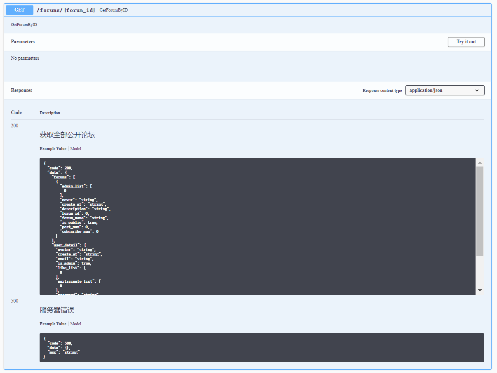

# BBS 开发总结

## 个人信息

| 字段        | 值                               |
| ----------- | -------------------------------- |
| 学院与专业  | 数据科学与计算机学院软件工程专业 |
| 姓名        | 郭凯杰                           |
| 学号        | 18342022                         |
| github 账号 | kaijietti                        |

## 开发感悟

本次前后端开发中我主要是负责后端的控制器的`forum`部分以及`swagger`文档的注解工具引入。

这是我第一次参与后端的开发，所以在家栋同学的基础框架上进行一些仿写，完成了控制器中注册路由、写控制器、与数据库交互的完整流程，收获很大。另外就是go下的`swag`工具的使用，使得文档能够通过注解来生成，简化了api文档的整个撰写流程。例如下面的例子：

```go
// GetForumByID godoc
// @Summary GetForumByID
// @Description GetForumByID
// @Tags Forums
// @Accept  json
// @Produce  json
// @Success 200 {object} responses.StatusOKResponse{data=ForumResponse} "获取全部公开论坛"
// @Failure 500 {object} responses.StatusInternalServerError "服务器错误"
// @Router /forums/{forum_id} [get]
func GetForumByID(c *gin.Context) {
	log.Info("get forum by id controller")
	var data ForumResponse
	forum_id, _ := strconv.Atoi(c.Param("forum_id"))
	forums, err := models.GetForumByID(forum_id)

	if err != nil {
		c.JSON(http.StatusInternalServerError, gin.H{"code": 500, "msg": "服务器错误: " + err.Error(), "data": data})
		return
	}
	user := service.GetUserFromContext(c)
	userDetail, err := service.GetOneUserDetail(user.UserId)
	if err != nil {
		c.JSON(http.StatusInternalServerError, gin.H{"code": 500, "msg": "查询用户信息错误: " + err.Error(), "data": data})
		return
	}

	data.UserDetail = userDetail
	data.Forums = forums
	c.JSON(http.StatusOK, gin.H{"code": 200, "msg": "获取论坛成功", "data": data})
}

```

对应生成的文档部分：



另外的收获就是熟悉了跨域问题和JWT的使用，以及中间件中传递数据（Context）。整体来说，我的贡献不多，都是看着大佬队友的代码来仿写，但看完这些代码的框架还是收获很大的。