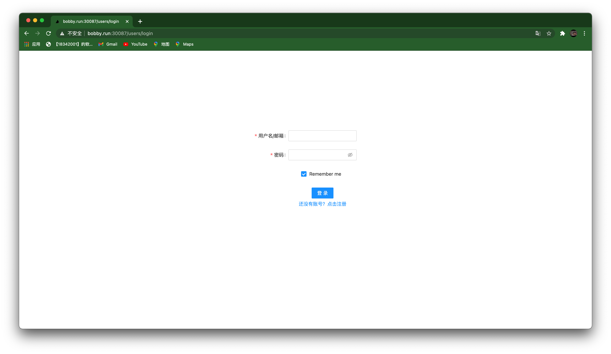
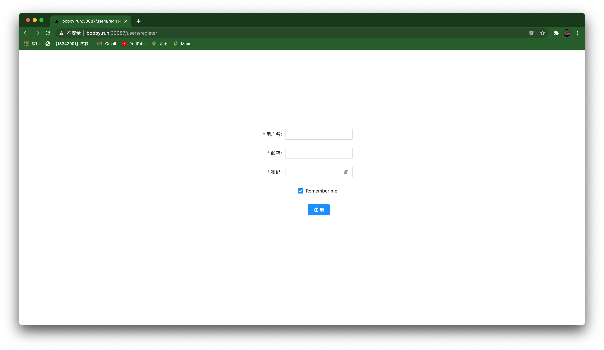
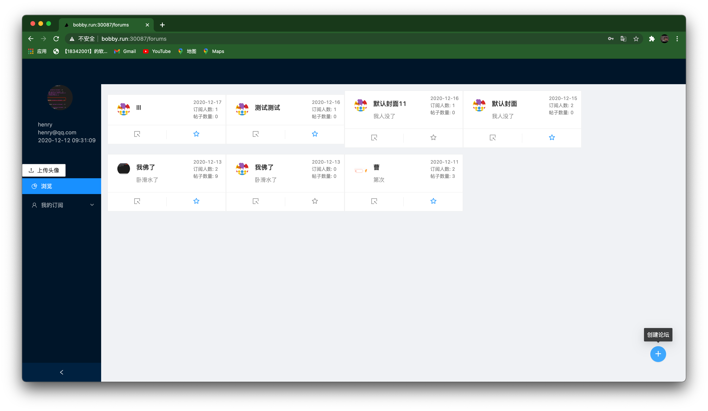
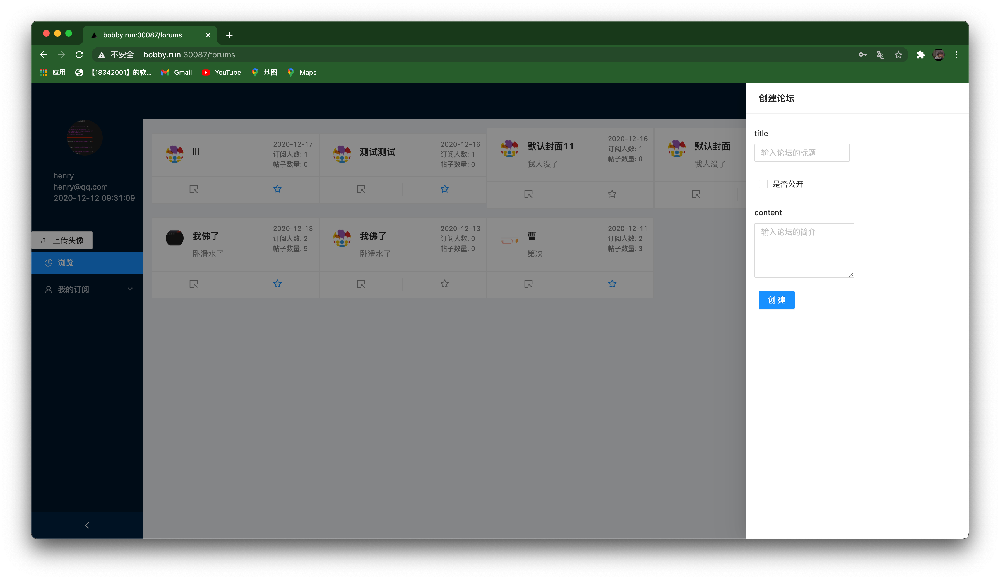
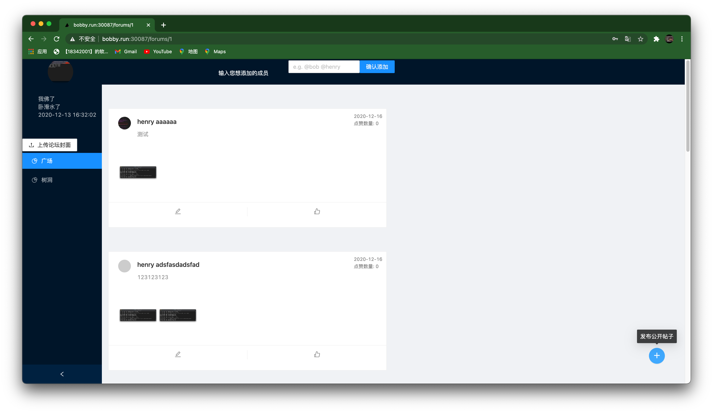
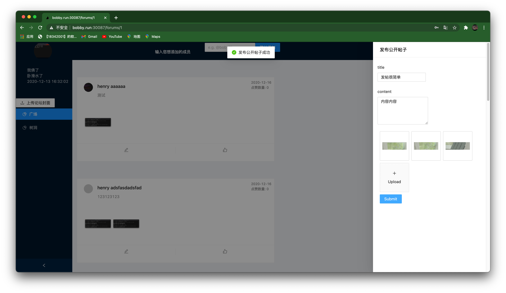
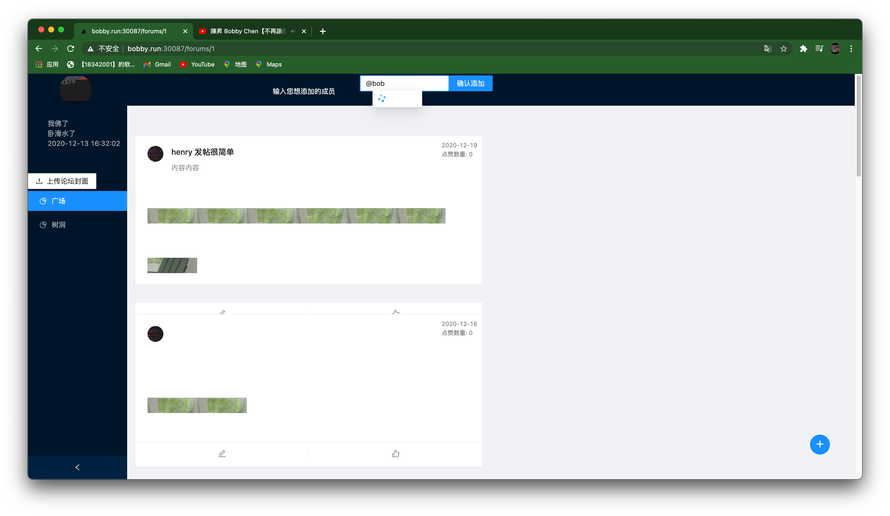
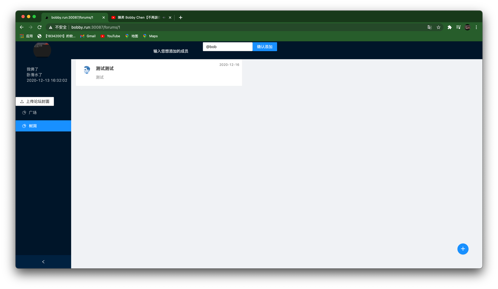
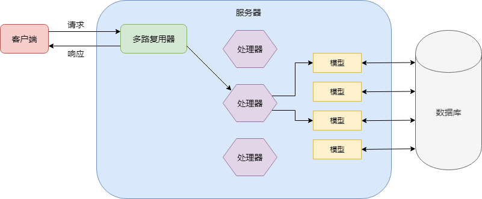

# BBS: 轻量级论坛系统

## 成员信息

| 姓名   | 学号     | Github 用户名        | 分工                                     |
| ------ | -------- | -------------------- | ---------------------------------------- |
| 白家栋 | 18342001 | bobbaicloudwithpants | 前端，后端的用户模块和帖子模块，项目部署 |
| 郭凯杰 | 18342022 | kaijietti | 后端的论坛模块和swag注解 |
| 胡梓渊 | 18342026 | HenryHZY | 后端的`hole`和`comment`模块 |

## 项目简介
BBS 是一个简介好用的论坛，在BBS上，你可以浏览丰富多彩的主题论坛，浏览他人的帖子，评论他人的帖子，当然也可以通过帖子的形式分享你所想要分享的；如果不想让别人知道你的名字，每个论坛都有树洞，在树洞里所有的帖子都是匿名的；同时你也可以创建属于自己的论坛，邀请你的好友加入你的论坛进行讨论，如果你不想公开你们的讨论，论坛支持私有创建，其中的内容只有论坛成员才可见。

## 项目访问方式
本项目已经部署在本组的 Kubernetes 集群上了，部署用到的文件参见 `k8s` 目录。在您的浏览器上输入：`http://bobby.run:30087/users/login` （推荐使用火狐浏览器或者谷歌浏览器）。      
可能因为服务器性能的缘故，访问时可能会有一些延迟，请您谅解。

## 技术栈
前端：使用基于 `React` 的 `Next.js` 框架    
后端：
- 服务端：用 golang 编写的web框架 `gin`
- 数据持久化：
  - 结构化数据：mysql
  - 非结构化数据：minio


## 项目部署方式
要部署该项目，有两种主要方式：

### 方法1: 通过 docker，docker-compose 部署(推荐)
- 前提条件：
  - 1. 在您的机器上已经配置了 docker 环境，并且 docker daemon 正在运行
  - 2. 3000 端口和 5000 端口没有被占用

- 部署方法：
  

首先进入`bbs_doc`目录
```
cd bbs_doc
```

然后在终端下输入：
```
docker-compose up
```
可能拉取镜像要花费一些时间。
然后访问 `http://localhost:3000/users/login` ，即可进入 bbs.

### 方法2: 通过分别编译运行前后端来运行

- 前提条件：
  - 1. 你的机器上有 `golang 1.14` 环境，并且开启 `GO111MODULE`; 您的机器上有 `node:14` 环境，并且包管理器 `yarn, npm` 可用。
  - 2. 3000 端口和 5000 端口没有被占用

- 部署方法：

  - 后端：
    - 首先下载后端项目：
    ```
    git clone https://github.com/service-computing-2020/bbs_backend.git
    ```
    - 然后进入项目根目录, 运行项目：
    ```
    cd bbs_backend
    go run main.go
    ```

  - 前端：
    - 首先下载前端项目：
    ```
    git clone https://github.com/service-computing-2020/bbs_frontend.git
    ```
    - 然后进入项目根目录，下载依赖：
    ```
    cd bbs_frontend
    yarn install
    ```
    - 编译项目：
    ```
    npm run build
    ```
    - 运行：
    ```
    npm run start
    ```
## API 文档访问方式

在您的浏览器（推荐火狐浏览器，谷歌浏览器可能会因为“不安全的”原因无法访问）输入：`http://bobby.run:30086/swagger/index.html`, 可以看到如下的画面：

将图中红色框的地址更换为：`http://bobby.run:30086/swagger/doc.json`, 可以看到：

下面便是我们本次后端的所有 API。

## API 设计
本次项目的所有后端 API 都严格遵守 restful api 风格。例如:
#### 用户登录和用户注册
- 登录：PUT /users 
- 注册：POST /users
这里用户资源统一使用 `users`, 使用 HTTP 方法的不同语义来群分对资源的操作，即 PUT 是提交信息交给服务器校验，而 POST 是创建一个资源。

#### 获取某个论坛下的某个post
- URL: /forums/:forum_id/posts/:post_id
- HTTP 方法: GET
这里很清晰的体现了资源的层次结构，即posts隶属于forums下，用id进行标示

## 前端设计
前端使用 `React` 生态中比较有名的框架 `Next.js` 作为基础框架；UI 组件使用了 Ant-design 中提供的组件。其中的所有组件都使用了 React 中的函数式组件，并结合了 `React Hook`. 大致界面构成为：
- 登陆界面

- 注册界面

- 广场界面


- 论坛界面






## 后端设计

#### 流程概览



图示解释（前面技术栈提到是`gin`框架）：

+ 多路复用器

  + 路由注册：

    使用`func (group *RouterGroup) XXX(relativePath string, handlers ...HandlerFunc) IRoutes`等系列方法进行路由注册，本次使用的主要有`GET/POST/PUT/DELETE/PATCH`等。这部分代码放在总控`main.go`中。

    同时注意到需要解决跨域、鉴权等问题，所以依旧是路由注册时链接上中间件，分别是解决跨域的中间件、JWT鉴权的中间件，注册方式例子：

    ```go
    userRouter.Use(middlewares.VerifyJWT())
    userRouter.GET("", controllers.GetAllUsers)
    ```

    或者：

    ```go
    singleForumRouter.POST("/cover", middlewares.VerifyJWT(), controllers.UploadCover)
    ```

  + 请求分发：

    由`gin`框架的`Engine`进行请求的分发，从而将请求的响应交给中间件或控制器控制。

+ 处理器

  + 控制器：

    控制器包含请求的处理，其函数签名为`func (c *gin.Context)`即可在复用器小节中进行路由注册，控制器会与模型交互，一个例子如下：

    ```go
    func GetAllUsers(c *gin.Context) {
    	log.Info("get all users controller")
    
    	var data []models.User
    	var err error
    	query := c.Query("username")
    	if query != "" {
    		data, err = models.GetAllUsersContains(query)
    	} else {
    		data, err = models.GetAllUsers()
    	}
    	if err != nil {
    		c.JSON(http.StatusInternalServerError, gin.H{"code": 500, "msg": "服务器错误: " + err.Error(), "data": data})
    		return
    	}
    
    	c.JSON(http.StatusOK, gin.H{"code": 200, "msg": "获取全部用户", "data": data})
    }
    ```

  + 中间件：

    这部分代码都放在`middlewares/`下。中间件上面已经提到过，这里给一个JWT鉴权中间件的例子：

    ```go
    func VerifyJWT() gin.HandlerFunc {
    	return func(c *gin.Context) {
    		log.Info("verify jwt middleware")
    		isError := false
    		var data interface{}
    		token := ExtractToken(c.Request)
    		if token == "" {
    			isError = true
    			c.JSON(http.StatusBadRequest, gin.H{
    				"code": 400,
    				"msg":  "缺少token",
    				"data": data,
    			})
    		} else {
    			claims, err := service.ParseToken(token)
    			if err != nil {
    				isError = true
    				c.JSON(http.StatusInternalServerError, gin.H{
    					"code": 500,
    					"msg":  "token校验发生错误",
    					"data": data,
    				})
    			} else if time.Now().Unix() > claims.ExpiresAt {
    				isError = true
    				c.JSON(http.StatusForbidden, gin.H{
    					"code": 403,
    					"msg":  "token已过期",
    					"data": data,
    				})
    			} else {
    				c.Set("Claims", claims)
    			}
    
    		}
    
    		if isError {
    			c.Abort()
    			return
    		}
    		c.Next()
    	}
    }
    ```

+ 模型

  + 与持久化层交互：

    具体代码在`models/`下，在这里主要是对从数据库中获取的结果进行基本转化，转化为模型。

    例如：

    ```go
    // User的模型
    type User struct {
    	UserId   int    `json:"user_id"`
    	Username string `json:"username"`
    	Email    string `json:"email"`
    	Password string `json:"password"`
    	IsAdmin  bool   `json:"is_admin"`
    	Avatar   string `json:"avatar"`
    	CreateAt string `json:"create_at"`
    }
    
    // 将数据库查询的结果转换为 User
    func convertMapToUser(user map[string]string) User {
    	user_id, _ := strconv.Atoi(user["user_id"])
    	is_admin := false
    	if user["is_admin"] == "1" {
    		is_admin = true
    	}
    
    	return User{UserId: user_id, Username: user["username"], Email: user["email"], Password: user["password"], IsAdmin: is_admin, Avatar: user["avatar"], CreateAt: user["create_at"]}
    }
    
    // 与数据库交互得到未加工数据
    func GetAllUsers() ([]User, error) {
    	var ret []User
    
    	res, err := QueryRows("SELECT user_id, username, password, email,is_admin, create_at, avatar FROM user")
    
    	if err != nil {
    		return nil, err
    	}
    
    	for _, r := range res {
    		ret = append(ret, convertMapToUser(r))
    	}
    
    	return ret, err
    }
    
    ```

  + 封装并为上层提供服务：

    具体代码在`service/`下，任务在于将于数据库交互得到的未加工数据进行加工、封装为控制器语义下需要的数据，其实就是基于数据库的数据对外提供具有语义信息的服务，比如用户注册时用户名或邮箱是否存在等等。

    

+ 数据库

  + 这里指的是持久化层：
    + 结构化数据：mysql
    + 非结构化数据：minio


